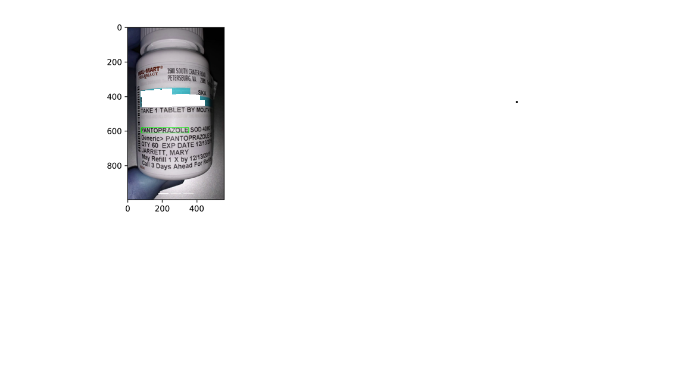
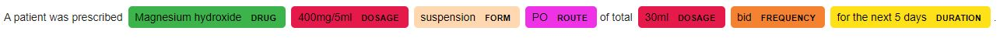
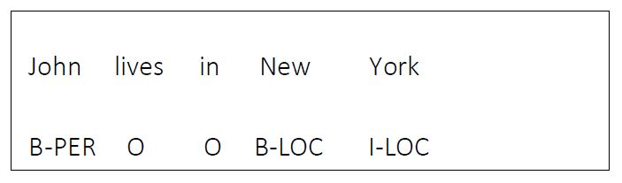

# OCR+NER for medicine name from drug labels

In this project, the task of medicine name identification from Drug Label bottles using Optical Character Recognition for image to text conversion and Named entity recognition for identifying the entity of the text from OCR was investigated.  
This can be seen from the image below. Given an image of a drug bottle, medicine name has to be idenitified and bounding boxes drawn around it. 

Other parameters can also be identified such as in the example shown below using spacy's med7 model. Such as given the input text :'A patient was prescribed Magnesium hydroxide 400mg/5ml suspension PO of total 30ml  bid for the next 5 days.', the results would be:  

This involes two steps:  
* Optical character recognition for image to text conversion
* Named entity recognition for identifying medicine name

__Tesseract OCR__:  
* For dateset generation and model training, three methods were used. The first involved using AWS Rekognition, second one involved using font files for synthetic data generation, whereas the third one involved using hocr-tools for generating image line data for Tesseract-OCR training.  
* Various factors such as base model for model training, Configuration parameters such as Page Segmentation Mode, Thread limit, Preprocessing factors such as Re scaling method and size, different threshold methods for Binarization (Simple and Adaptive threshold) were analyzed for improving performance.  

__Named Entity recognition__:  
* Dataset generation in B-I-O tagging format

* Various models such as Memory tagger, Random forest classifier, Conditional Random Fields, Sequence tagging using LSTM were trained and their performance analyzed.

The final model had an accuracy of 76% with an average time of 1 second per image as compared to the baseline tesseract with 50% accuracy and an average time of 2.24 second per image.  

The report contains detailed instructions containing details regarding the steps explained above.

 
